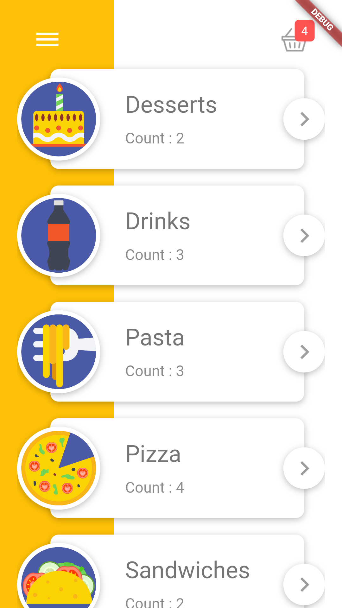
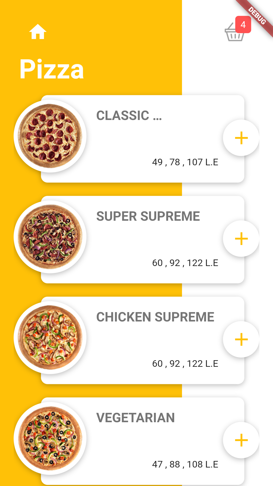
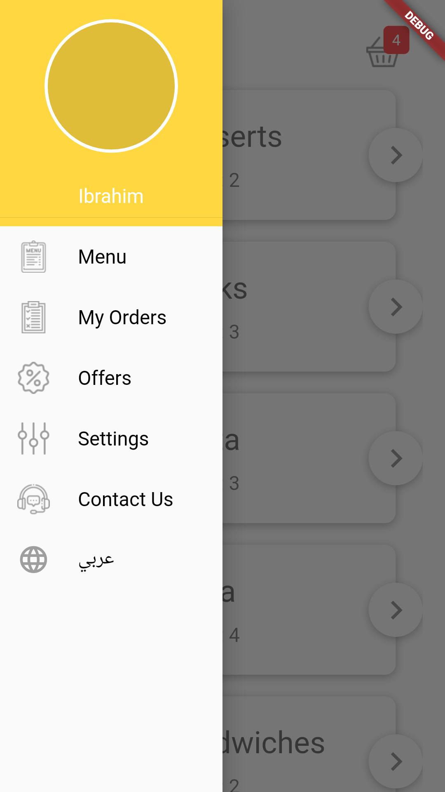
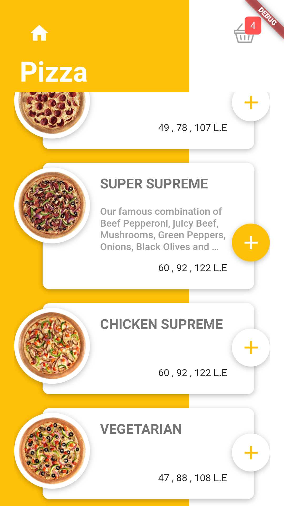
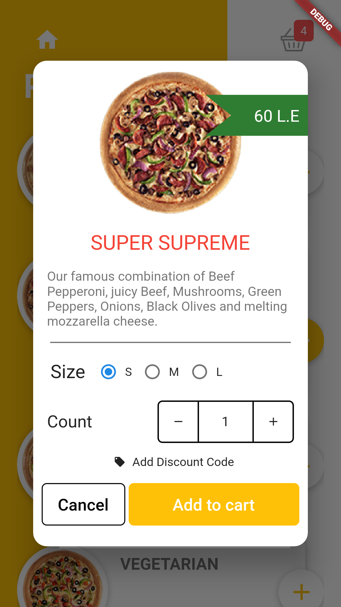
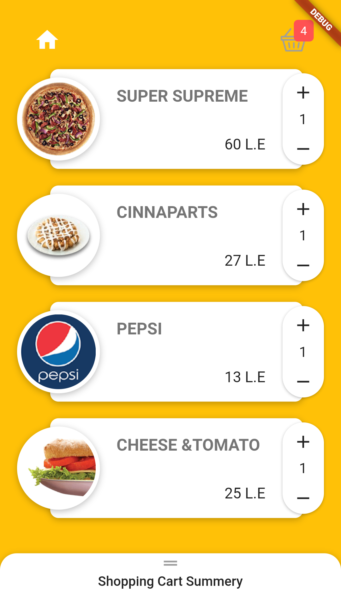
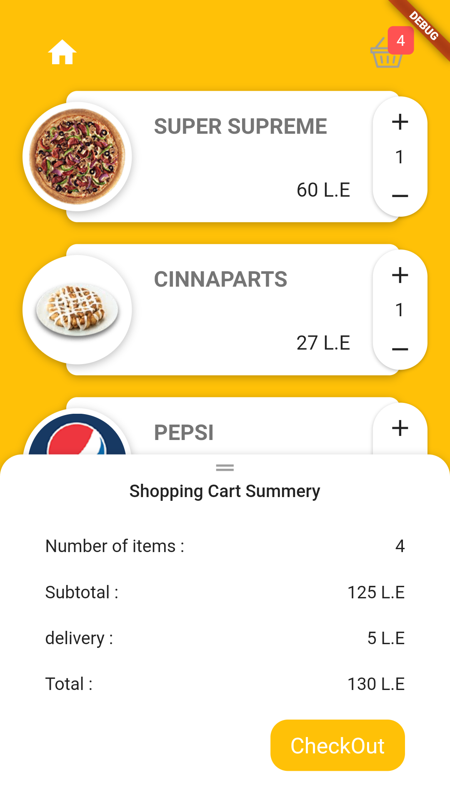
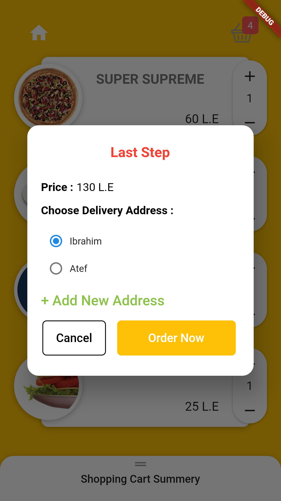

# flutter-ResturantApp
Flutter Food Ordering App made with Dart

# Features:
- Login, Logout and Signup using Firebase.
- Manage and personalize your account.
- Beautiful UI with Carousel and nice Color combinations.
- Offline Capabilities.
- Navigation between diffrent screens and categories using  Provider .
- Choose your Meal size and quantities .
- Add items to your shopping cart and save them for later.
- Manage your cart , edit and delete your orders list.

# ScreenShots:
  
  
 
